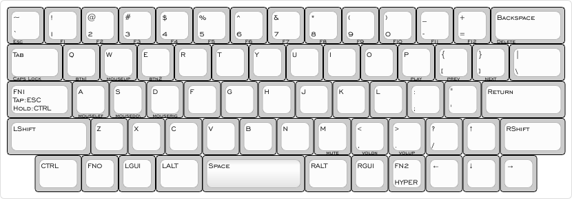

# Exp60 - An opinionated 60% with arrow keys PCB

---

[Link to Keyboard Layout Editor project](http://www.keyboard-layout-editor.com/#/gists/84f70adc6e3be321baacc794c3d78efd)

## Why?

I've always preferred the size of a 60%, but never managed to kick the arrow key addiction. Having tried the `dz60` and `dz64` from kbdfans (dz64 being my fav), they both have trade-offs I've never been quite happy with.

## Design constraints

1. 60% form factor, roughly the same size as a GH60.
2. Arrow cluster
3. Standard 2.25U left shift
4. Standard 1U forward slash / question mark key
5. Bottom row should have `CTRL`, `Fn`, `GUI`, `ALT` and `HYPER` keys
6. USB-C
7. Hot-swap
8. Hand solderable

## How was this layout chosen?

In order to meet design constraints 2, 3 and 4, the arrow cluster needs to be located next to the forward slash key. The right arrow key only has 0.75U of space to its right, so we have the `HHKB-esque` gaps at the edges of the bottom row.

To meet design constraint 5, the space bar needs to be shrunk to 2.75U. I've been daily driving a heavily modded `HHKB Pro JP` since 2017 so this is A-OK to me.

## PCB Design choices

1. All SMD components due to limited space.
2. Use `atmega32u2au` MCU instead of `atmega32u4au` due to limited space (32 vs 48 pins).
3. Large footprint SMD components so everything is hand solderable.

## Inspirations

- [JP60 by ai03](https://github.com/ai03-2725/JP60)

  60%, USB-C, ESD and over voltage/currrent protection.

- [Keyboard Matías](https://github.com/nstrappazzonc/keyboard)

  This design uses the `atmega32u2au` MCU, which is crucial for fitting the MCU on my board.
